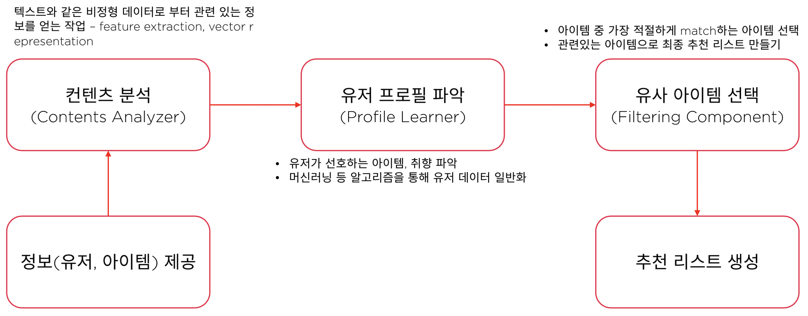
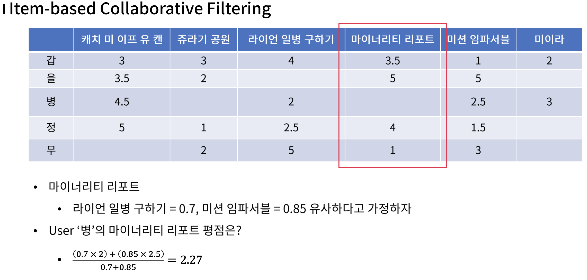

# 추천 시스템

> Generate candidates -> Apply constraint -> Ranking

## Algorithm

- **Contents based filtering**

  > 콘텐트 간의 연관성 활용해(cos similarity, 유클리디안 거리 등) 과거에 관심 있던 아이템 x와 유사한 아이템 y를 현재 시점에 추천. 어떤 feature를 추출하여 무엇이 유사한지 결정하는 것이 핵심. KNN, 나이브 베이즈 알고리즘 주로 사용.

  * 장점
    * 다른 유저의 데이터가 필요하지 않음.
    * 추천할 수 있는 아이템의 범위가 넓음.(Unique, New, Unpopular 아이템 모두 가능)
    * 추천시스템이 추천한 이유 설명 가능.(특정 feature 기반으로 분석)

  * 단점

    * 적절한 feature 찾는 것이 어려움.
    * 데이터가 부족한 새로운 user를 위한 추천이 어려움.
    * 선호하는 특성을 가진 항목을 반복 추천하기 때문에 유저의 다양한 취향을 반영하기 어렵고, user profile과 관련되지 않은 아이템은 추천되지 않음.

  * Architecture

    

    User profile 학습(Profile Learner)은 classification 문제를 푸는 것과 유사하다고 볼 수 있음.

  * Key

    * Contents Analyzer의 알고리즘을 TF-IDF, ML, Clustering등 어떤 것을 적절하게 선택하는지가 중요.

  * Algorithm

    * KNN : K는 보통 홀수로 지정하며, 적절한 K를 설정하는 것 중요(grid search). 유클리드 거리 기반으로 근접 정도 측정. 각 feature간의 normalization 필수(min-max scaling 등)
    * Naive Bayes : feature간 서로 독립적이어야 효과적. Continuous한 값보다 Discrete한 variable에서 더 효과적(독립 가정 좀 더 부합). 데이터 차원이 높아질 수록 모든 class에 대한 확률이 0으로 수렴 가능하며 이때 Laplace smoothing 활용.

 

* **Neighborhood-based collaborative filtering(Memory-based)**

  > 이웃 기반 협업 필터링(index 간의 유사도 확인)

  * User-based : User가 Index(사용자 기반으로 유사도 계산), Item이 Feature. 나와 비슷한 평점을 메긴 다른 사람들이 어떤 종목을 선택했는지 추천.

  * Item-based : Item이 Index(아이템 기반으로 유사도 계산), User가 Feature. 해당 종목을 선택한 다른 고객들이 선택한 다른 종목 추천.

    

  * 선택

    * 보통 User 수 < Iterm인 경우 User-based, User 수 > Item인 경우 Item-based 사용. 이유는 더 적은 것을 기준으로해야 matrix가 덜 sparse해지기 때문.
    * 주로 Item 수가 크게 변하지 않는다면, Item-based, User 수가 크게 변하지 않는다면, User-based 사용.
    * User-based는 과거 아이템 데이터에 의존하기 때문에 새로운 추천이 어려운 반면, Item-based는 여러 유저 데이터를 활용하기 때문에 새로운 추천이 수월함.
    * 새로운 user, item이 추가되더라도 비교적 안정적.

  * 단점

    * Cold-Start : 유저에 대한 아무런 기록이 없다면, 새로운 아이템에 대한 아무런 정보 없다면, 추천 불가능.
    * 데이터가 많아야 추천 품질 좋아지지만, 계산량 많아짐(Trade-Off).
    * Long-Tail Economy : 관심이 쏠린 아이템만 계속 추천되고, 관심이 상대적으로 적은 아이템은 추천되지 않음.

  * Latent Factor : 잠재 요인 협업 필터링

* **Model-based collaborative filtering**

* 

이이템 기반 최근접 이웃 방식은 '아이템 간의 속성'이 얼마나 비슷한지를 기반으로 추천한다고 착각할 수 있다. 하지만 컨텐츠 기반 필터링은 컨텐츠 간의 유사도만을 가지고 측정한 것이고, 아이템 기반 협업 필터링은 개인적인 취향을 반영한 것이다. 주의

일반적으로 최근접 이웃 협업 필터링은 사용자 기반 보다는 아이템 기반 필터링이 정확도가 더 높다. 이유는 비슷한 영화를 좋아한다고 해서 사람들의 취향이 비슷하다고 판단하기는 어려운 경우가 많기 때문이다. 매우 유명한 영화는 취향과 관계없이 대부분의 사람이 관람하는 경우가 많고, 사용자들이 평점을 매긴 영화의 개수가 많지 않은 경우가 일반적인데 이를 기반으로 다른 사람과의 유사도를 비교하기 어려운 부분도 있기 때문이다.

코사인 유사도는 추천 시스템의 유사도 측정에 각장 많이 사용된다. 

 

## 잠재 요인 협업 필터링(Latent Factor C.F)

원본 행렬을 SVD(Singular Vector Decomposition), NMF(Non-Negative Matrix Factorization)와 같은 차원 감소 기법으로 분해하여 잠재 요인을 추출한다(행렬 분해, 고차원 희소 행렬을 저차원 밀집 행렬 P와 Q로 분해). 분해된 데이터 세트를 다시 내적 곱으로 결합하면서 사용자가 예측하지 않은 아이템에 대한 평점을 도출하는 방식이다.

행렬 분해에 의해 추출되는 ''잠재 요인''이 정확히 어떤 것인지는 알 수 없다.

SVD는 Null이 없는 행렬에만 적용할 수 있기 때문에 확률적 경사 하강법(SGD)이나 ALS(Alternating Least Squares) 방식을 이용해 수행한다.

 

## 추천 시스템의 한계

**Cold Start**
새로운 또는 어떤 유저들에 대한 충분한 정보가 수집된 상태가 아니라서 해당 유저들에게 적절한 제품을 추천해주지 못하는 문제 => content based + collaborative 등의 조합으로 극복한다.

트렌드 변화, 또는 사용자의 관심사 변화 등으로 과거의 학습된 모델이 새로운 변화를 반영하지 못하는 경우

**Long**-**Tail Economy**
수 많은 데이터 중, 대중의 관심을 받는 일부(약 10%)만 계속 추천되는 경우. 다양성 부족.

 

## 유사도

* Euclidean-distance(거리)
* Cos similarity(각도)
* Peason similarity : 정규화 된 Cos similarity. 예를 들어 A유저가 5개의 아이템에 모두 5점, B유저가 동일한 5개의 아이템에 모두 1점을 부여했을 경우, Cos similarity는 1을 갖지만, Pearson similarity는 그렇지 않음.
* Jaccard similarity(집합)

## 평가 지표

추천 시스템은 regression 또는 ranking 문제로 분류되는데 regression의 경우 일반적으로 rmse 평가 지표를 사용하고, ranking 문제에선 일반적으로 ndcg(normalized discounted cumulative gain)사용한다.
ndcg 참고, https://blog.naver.com/stu5073/222203260105

 

## 논문 및 코드

**Training Deep AutoEncoders for Collaborative Filtering(2017.08)**

https://github.com/NVIDIA/DeepRecommender

**Graph Convolutional Matrix Completion(2017.10)**

https://github.com/tkipf/gae

**Session-based Recommendations with Recurrent Neural Networks(2015.11)**

https://github.com/hidasib/GRU4Rec

**Recurrent Neural Networks with Top-k Gains for Session-based Recommendations(2017.06)**

https://github.com/hidasib/GRU4Rec

**Session-based Recommendation with Graph Neural Networks(2018.11)**

https://github.com/CRIPAC-DIG/SR-GNN

**Wide & Deep Learning for Recommender Systems(2016.06)**

https://github.com/shenweichen/DeepCTR

**DeepFM: A Factorization-Machine based Neural Network for CTR Prediction(2017.03)**

https://github.com/shenweichen/DeepCTR